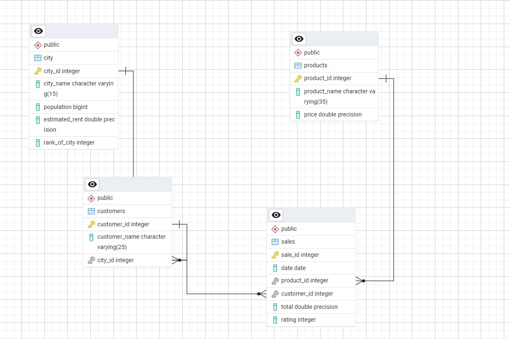

# Welcome to my Coffee shop project!


## Project Overview

### Getting the data
The data for this project was downloaded using the Kaggle API. To do so, I used an API key that was saved as a JSON file. If you wish to download the dataset in the same way, follow these steps:
1. Obtain your Kaggle API key by visiting [Kaggle's API page](https://www.kaggle.com/docs/api).
2. Download the `kaggle.json` file and place it in the following directory: `C:\users\your_user_name\.kaggle\kaggle.json`.
3. To download the dataset, run the following command in your terminal:

   ```bash
   kaggle datasets download -d username_of_the_dataset_provider/name_of_the_dataset_on_kaggle

### Database
For this project, I used PostgreSQL as the database to store and manage the data. Firstly I have created the schema for the tables, which can be viwed in `structure.sql` file and the queries I solved are present inside the `queries.sql` file.
